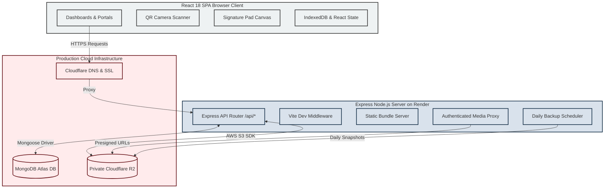

# CleanCheck System Architecture & Design Manual (v1.0.0)

This document provides an architectural overview of the CleanCheck multi-tenant facility management platform.

---

## 🗺️ High-Level System Architecture

CleanCheck is built as a single-service full-stack web application. It integrates a React 18 Single Page Application (SPA) with an Express Node.js backend running on Render, backed by **MongoDB Atlas** as the operational system of record and **Cloudflare R2** for object storage.

---

## 🛠️ Express + Vite Single Engine Architecture

CleanCheck is bundled as a single, unified codebase:

1. **Vite Dev Middleware**: In development mode (`NODE_ENV !== "production"`), Express dynamically mounts Vite middleware for HMR and asset serving on port `3000`.
2. **Production Compilation**: When running `npm run build`, `esbuild` bundles `/server.ts` into a standalone CommonJS file `dist/server.cjs` and Vite builds client-side static bundles inside `dist/`.
3. **Production Server**: In production (`npm start`), Express directly serves `dist/index.html` and static assets from `dist/`, handling `/api/*` requests natively.

---

## 🗄️ Database & Storage Engine

- **MongoDB Atlas**: Primary operational database storing users, organizations, facility hierarchies (buildings/floors/rooms), QR codes, assignments, inspections, audit logs, and settings.
- **Cloudflare R2 Object Storage**: Private S3-compatible storage engine for uploaded photos, signature assets, and daily JSON database snapshots.
- **Private Access Control**: Media references are stored as `/api/media/uploads/:filename`. Requesting users are authenticated, and presigned S3 URLs (15-min expiry) are generated dynamically for authorized users.

---

## 🔄 Offline Inspection & Synchronization

- **Client IndexedDB Buffering**: When field inspectors lose network connectivity, inspections are stored locally in browser IndexedDB with queued sync actions.
- **Automatic Reconnection Flush**: When connectivity is restored, queued offline submissions are posted to `/api/inspections` automatically.
- **Idempotency & Deduplication**: Inspection receipts and room tokens prevent duplicate record creation.
